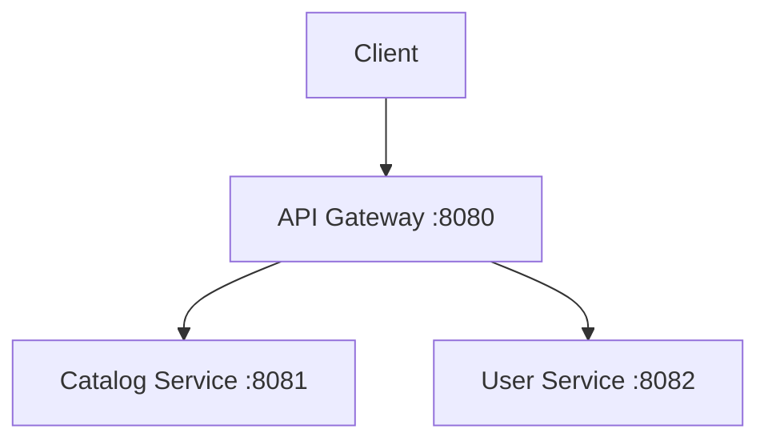

# About the Implementation

## Overview

This project demonstrates a basic implementation of the **API Gateway pattern** using Spring Boot and Spring Cloud in a **multi-module Maven setup**.

The goal is to:

* Create two simple backend microservices (`user-service` and `catalog-service`)
* Route external requests through an `api-gateway`
* Keep the implementation minimal and focused only on routing
* Exclude advanced concepts such as circuit breakers, rate limiting, or service discovery (these are handled separately)

By following this document, the gateway setup can be replicated step by step.

***

# 1. Project Structure

We use a **multi-module Maven project**.

The parent project manages dependency versions and contains the three modules.

```
parent-project/
├── pom.xml
├── api-gateway/
│   └── pom.xml
├── user-service/
│   └── pom.xml
└── catalog-service/
    └── pom.xml
```

The parent project:

* Defines Spring Boot
* Imports the Spring Cloud BOM
* Declares modules
* Centralizes dependency versions

Each module contains only the dependencies it needs.

***

# 2. Parent Project Configuration

The parent project is responsible for:

* Defining the Spring Boot version
* Importing the Spring Cloud BOM
* Managing dependency versions centrally

## `parent-project/pom.xml`

```xml
<parent>
    <groupId>org.springframework.boot</groupId>
    <artifactId>spring-boot-starter-parent</artifactId>
    <version>3.5.10</version>
</parent>

<packaging>pom</packaging>

<modules>
    <module>api-gateway</module>
    <module>catalog-service</module>
    <module>user-service</module>
</modules>

<properties>
    <java.version>21</java.version>
    <spring-cloud.version>2025.0.1</spring-cloud.version>
</properties>

<dependencyManagement>
    <dependencies>
        <dependency>
            <groupId>org.springframework.cloud</groupId>
            <artifactId>spring-cloud-dependencies</artifactId>
            <version>${spring-cloud.version}</version>
            <type>pom</type>
            <scope>import</scope>
        </dependency>
    </dependencies>
</dependencyManagement>
```

Important:

* The **Spring Cloud BOM is declared only here**
* No module should redefine `dependencyManagement`
* No module should hardcode Spring Cloud versions

This ensures version consistency across all modules.

***

# 3. Backend Microservices

The `user-service` and `catalog-service` are simple Spring MVC applications.

They use the traditional servlet stack (`spring-boot-starter-web`).

***

## 3.1 catalog-service

### `catalog-service/pom.xml`

```xml
<dependencies>
    <dependency>
        <groupId>org.springframework.boot</groupId>
        <artifactId>spring-boot-starter-web</artifactId>
    </dependency>
</dependencies>
```

### `application.yaml`

```yaml
server:
  port: 8081
```

### Controller

```java
@RestController
@RequestMapping("/catalog")
public class CatalogController {

    @GetMapping("/test")
    public String test() {
        return "Catalog Service is working!";
    }
}
```

Test directly:

```
http://localhost:8081/catalog/test
```

***

## 3.2 user-service

### `user-service/pom.xml`

```xml
<dependencies>
    <dependency>
        <groupId>org.springframework.boot</groupId>
        <artifactId>spring-boot-starter-web</artifactId>
    </dependency>
</dependencies>
```

### `application.yaml`

```yaml
server:
  port: 8082
```

### Controller

```java
@RestController
@RequestMapping("/users")
public class UserController {

    @GetMapping("/test")
    public String test() {
        return "User Service is working!";
    }
}
```

Test directly:

```
http://localhost:8082/users/test
```

At this point, both microservices work independently.

***

# 4. API Gateway Module

The `api-gateway` is a reactive application using:

* Spring Cloud Gateway
* Spring WebFlux

It must NOT include `spring-boot-starter-web`.

***

## 4.1 api-gateway Dependencies

### `api-gateway/pom.xml`

```xml
<dependencies>
    <dependency>
        <groupId>org.springframework.boot</groupId>
        <artifactId>spring-boot-starter-webflux</artifactId>
    </dependency>

    <dependency>
        <groupId>org.springframework.cloud</groupId>
        <artifactId>spring-cloud-starter-gateway-server-webflux</artifactId>
    </dependency>

    <dependency>
        <groupId>io.projectreactor</groupId>
        <artifactId>reactor-test</artifactId>
        <scope>test</scope>
    </dependency>
</dependencies>
```

Important:

* WebFlux is required because the gateway is reactive
* Do NOT include `spring-boot-starter-web`
* Do NOT redefine Spring Cloud versions here

***

## 4.2 Gateway Configuration

### `api-gateway/application.yaml`

```yaml
server:
  port: 8080

spring:
  cloud:
    gateway:
      server:
        webflux:
          routes:
            - id: catalog-service-route
              uri: http://localhost:8081
              predicates:
                - Path=/catalog/**

            - id: user-service-route
              uri: http://localhost:8082
              predicates:
                - Path=/users/**
```

This configuration defines two routes:

* `/catalog/**` → forwarded to `localhost:8081`
* `/users/**` → forwarded to `localhost:8082`

***

# 5. How Routing Works

When a request is sent to:

```
http://localhost:8080/users/test
```

The gateway:

1. Evaluates the `Path=/users/**` predicate
2. Matches the route
3. Forwards the request to:

```
http://localhost:8082/users/test
```

The path is preserved. The gateway only changes:

* Host
* Port

It does not duplicate the path.

Same logic applies for `/catalog/test`.

***

# 6. Running the System

To replicate the full behavior:

### Step 1 – Build everything

From the parent directory:

```
mvn clean install
```

### Step 2 – Start services

Start in this order:

1. `user-service`
2. `catalog-service`
3. `api-gateway`

### Step 3 – Test through the gateway

Test:

```
http://localhost:8080/users/test
http://localhost:8080/catalog/test
```

You should receive:

```
User Service is working!
Catalog Service is working!
```

If this works, the API Gateway is functioning correctly.

***

# 7. Architecture Diagram



The gateway acts as the single entry point to the system.

***

# 8. What This Implementation Does NOT Include

This minimal setup intentionally excludes:

* Service Discovery
* Load Balancing
* Circuit Breaker
* Rate Limiting
* Security

Those concepts are implemented in separate projects or later stages.

This document focuses only on establishing the API Gateway and verifying basic routing behavior.

***

# Final Result

At this stage, you have:

* A parent project managing versions
* Two independent microservices
* A reactive API Gateway routing requests correctly
* A clean separation between infrastructure and business logic

This provides the foundation for introducing more advanced distributed system mechanisms later.
