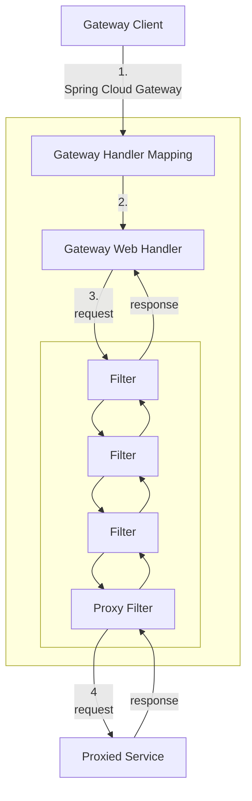
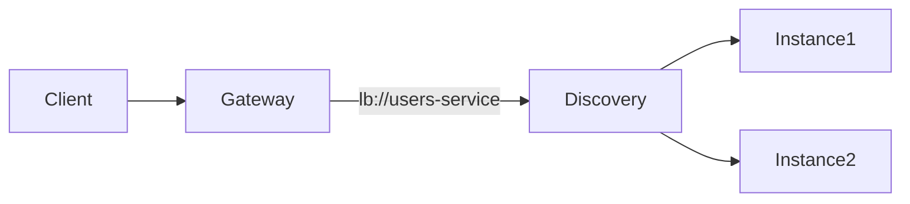

# API Gateway with Spring

## Spring Cloud Gateway

## What Is It

Spring Cloud Gateway is the official Spring-based implementation of the API Gateway pattern. It is built on top of **Spring Boot**, **Spring WebFlux**, and **Project Reactor**, and runs on a non-blocking Netty server.

Unlike traditional servlet-based gateways, Spring Cloud Gateway is fully reactive. This means it does not block threads while waiting for downstream services to respond. Instead, it relies on asynchronous, event-driven processing. As a result, it can handle a large number of concurrent requests efficiently, making it especially suitable for distributed systems and microservice architectures.

In practice, it acts as the main entry point for microservices and provides capabilities such as:

* Routing requests to appropriate backend services
* Filtering and transforming requests and responses
* Integration with service discovery mechanisms
* Integration points for resilience mechanisms (such as circuit breakers and rate limiting)
* Request and path transformation features

Configuration can be defined declaratively (using YAML or properties files) or programmatically through Java-based configuration. This flexibility allows teams to adapt it to different architectural needs.

***

## Adding Spring Cloud Gateway to a Project

In a typical Spring Boot setup, the gateway is implemented as a standalone application. Its primary responsibility is to manage and control traffic between clients and backend services. It does not contain business logic; instead, it focuses purely on infrastructural concerns.

### 1. Dependency Management (Maven)

Spring Cloud should be imported using the Spring Cloud BOM. In this project, the BOM is declared in the parent POM (see [About the Implementation](ABOUT-THE-IMPLEMENTATION.md)):

```xml
<dependencyManagement>
    <dependencies>
        <dependency>
            <groupId>org.springframework.cloud</groupId>
            <artifactId>spring-cloud-dependencies</artifactId>
            <version>2025.0.1</version>
            <type>pom</type>
            <scope>import</scope>
        </dependency>
    </dependencies>
</dependencyManagement>
```

The `spring-cloud-dependencies` artifact is a **BOM (Bill Of Materials)**. A BOM is a special POM file that centralizes and manages compatible versions of all Spring Cloud modules.

By importing the BOM:

* You do not need to specify versions for individual Spring Cloud dependencies.
* Maven automatically resolves versions that are guaranteed to be compatible with each other.
* You avoid version conflicts between different Spring Cloud components.

The `<dependencyManagement>` section does not add dependencies to the project. It only defines which versions should be used when those dependencies are declared later.

Then, add the gateway and WebFlux dependencies. In this project we use:

```xml
<dependency>
    <groupId>org.springframework.boot</groupId>
    <artifactId>spring-boot-starter-webflux</artifactId>
</dependency>

<dependency>
    <groupId>org.springframework.cloud</groupId>
    <artifactId>spring-cloud-starter-gateway-server-webflux</artifactId>
</dependency>
```

Notice that no `<version>` is specified; versions are inherited from the parent (Spring Boot and Spring Cloud BOM). WebFlux is required because the gateway is reactive. The `spring-cloud-starter-gateway-server-webflux` artifact is the WebFlux-based gateway starter.

Do not include the Spring MVC starter (`spring-boot-starter-web`), since Spring Cloud Gateway is built on WebFlux. Mixing it with the traditional servlet stack can lead to configuration conflicts and unexpected behavior.

***

## Key Features

Spring Cloud Gateway offers features specifically designed for modern distributed architectures.

It supports highly flexible routing rules based on virtually any request attribute. Routes can be defined using path patterns, HTTP methods, hostnames, headers, or query parameters. This makes it possible to express complex routing behavior without writing custom infrastructure code.

Each route can define its own predicates and filters. This allows fine-grained control over how requests are handled per backend service, while keeping configuration centralized at the gateway level.

It integrates naturally with the broader Spring Cloud ecosystem. For example, it can work with service discovery tools such as Eureka or Consul. It also integrates with resilience mechanisms like circuit breakers and rate limiters. Although those patterns are discussed in separate sections, it is important to understand that the gateway is often where they are enforced.

It supports path rewriting and header manipulation. This enables public APIs to differ from internal service endpoints, allowing backend services to evolve without breaking external contracts.

Finally, it is fully programmable. Developers can implement custom predicates and filters in Java to address specific infrastructure requirements, making the gateway highly extensible.

***

## Core Components

Spring Cloud Gateway is structured around three fundamental building blocks: *Route*, *Predicate*, and *Filter*.

### Route

A Route defines how a request should be processed. It typically includes:

* A unique identifier (`id`)
* A destination `uri`
* One or more predicates
* Optional filters

A route is considered a match only if all of its predicates evaluate to true.

In this project, routes are configured under `spring.cloud.gateway.server.webflux.routes`:

```yaml
spring:
  cloud:
    gateway:
      server:
        webflux:
          routes:
            - id: catalog-service-route
              uri: http://localhost:8081
              predicates:
                - Path=/catalog/**

            - id: user-service-route
              uri: http://localhost:8082
              predicates:
                - Path=/users/**
```

Requests matching `/catalog/**` are forwarded to the service on port 8081; those matching `/users/**` go to port 8082. The gateway does not need to know how those services are implemented; it simply proxies the request.

This separation of concerns allows services to evolve independently while the gateway maintains a stable external interface.

***

### Predicate

A Predicate is responsible for determining whether a request matches a route. Internally, it operates on a `ServerWebExchange`, which provides access to the entire HTTP request context.

Common predicates include:

* `Path`
* HTTP `Method`
* `Header`
* `Host`
* `Query` parameters

Example combining multiple predicates.

```yaml
predicates:
  - Path=/orders/**
  - Method=GET
```

In this case, only GET requests targeting `/orders/**` will match the route. This level of control allows precise routing definitions without embedding custom logic in the codebase.

***

### Filter

Filters are responsible for modifying requests or responses. They can execute logic before the request is forwarded (pre-filters) or after a response is received (post-filters).

Examples of common filters:

* `AddRequestHeader`
* `RemoveRequestHeader`
* `RewritePath`
* Circuit breaker integration
* Rate limiter integration

Example of path rewriting:

```yaml
filters:
  - RewritePath=/api/catalog/(?<segment>.*), /${segment}
```

This configuration makes it possible to expose `/api/catalog/**` externally while internally forwarding requests to `/catalog/**`. This decouples the public API structure from internal service paths.

***

## How It Works Internally

The internal request lifecycle in Spring Cloud Gateway follows a structured pipeline.

1. A client sends a request to the gateway.
2. The Gateway Handler Mapping checks whether a route matches the request.
3. If a match is found, the request is passed to the Gateway Web Handler.
4. The request flows through a chain of filters.
5. The gateway forwards the proxied request to the destination service.
6. The response returns through the same filter chain before being sent back to the client.



This structured pipeline ensures that infrastructural logic is applied consistently and predictably. A key architectural principle is that the gateway defines *how* requests move through the system, not *what* the business logic does.

***

## Dynamic Routing with Service Discovery

In distributed systems, services should not be referenced using fixed URLs. Hardcoded addresses reduce flexibility and make scaling or relocating services more difficult.

Spring Cloud Gateway integrates with Spring Cloud DiscoveryClient, allowing routes to reference logical service names instead of static hostnames.

```yaml
uri: http://localhost:8081
```

to:

```yaml
uri: lb://users-service
```

The `lb://` prefix indicates that client-side load balancing should be used to locate an available service instance. This enables horizontal scaling and dynamic environments without requiring changes in gateway configuration every time a service instance changes.



***

## Integration with Other Distributed System Mechanisms

Although patterns like Circuit Breaker and Rate Limiter are explained in separate sections, they are frequently integrated at the gateway level.

For example:

* A Circuit Breaker can be applied as a filter to prevent forwarding traffic to unstable services.
* A Rate Limiter can control how many requests are allowed to reach backend services.
* Authentication filters can validate tokens before requests are proxied.

In each case, the gateway serves as the enforcement boundary for infrastructure-level policies, while backend services remain focused on business concerns.

The concepts of *circuit breaker* and *rate limiter* are briefly introduced here. For a deeper explanation, refer to:

* [Circuit Breaker](../circuit-breaker/CIRCUIT-BREAKER.md)
* [Rate Limiter](../rate-limiter/RATE-LIMITER.md)

### Resilience with Circuit Breakers

Distributed systems are inherently unreliable. Services may fail, slow down, or become temporarily unavailable. If these failures are not contained, they can propagate and cause cascading failures.

Spring Cloud Gateway integrates with Spring Cloud Circuit Breaker and commonly uses Resilience4j as an implementation.

A route with a circuit breaker may look like this:

```yaml
filters:
  - CircuitBreaker=myOrdersBreaker
```

When failures exceed a configured threshold, the circuit breaker opens and stops forwarding requests to the failing service. This prevents overload and gives the service time to recover.

Resilience must be intentionally designed. The gateway provides a natural control point for enforcing such protections.

***

### Rate Limiting and Traffic Control

Controlling traffic volume is another important gateway responsibility.

Spring Cloud Gateway offers a `RequestRateLimiter` filter, often backed by Redis. If a client exceeds the allowed request rate, the gateway responds with HTTP 429 (Too Many Requests).

This mechanism protects backend services from accidental overload, abuse, or malicious traffic spikes.

Rate limiting strategies can be based on:

* Client IP address
* Authenticated user ID
* API key
* Custom headers

By centralizing rate limiting at the gateway level, traffic control logic does not need to be duplicated across services.

***

## Global Filters vs Route-Specific Filters

Filters in Spring Cloud Gateway can be applied at two different levels.

Route-specific filters (`GatewayFilter`) apply only to a single route. They are useful when behavior is specific to a particular backend service.

Global filters (`GlobalFilter`) apply to all requests that pass through the gateway. They are typically used for concerns such as:

* Logging
* Correlation ID injection
* Metrics collection
* Global authentication logic

Choosing the appropriate level ensures that cross-cutting concerns remain centralized, while avoiding unnecessary coupling between unrelated routes.

***

## Summary

Spring Cloud Gateway provides a reactive, extensible, and production-ready implementation of the API Gateway pattern in Java.

It enables declarative route configuration, flexible filtering, integration with service discovery, and seamless connection to resilience mechanisms. Its reactive architecture allows efficient resource usage under high concurrency.

Within a distributed systems architecture, the gateway serves as the concrete entry point. It defines how external traffic enters the system and how requests are routed internally, forming the structural foundation on which additional distributed system patterns can be layered.

***

## References

* [Spring Cloud Gateway Project Page](https://spring.io/projects/spring-cloud-gateway)
* [Spring Cloud Gateway Reference Documentation](https://docs.spring.io/spring-cloud-gateway/docs/current/reference/html/)
* [Spring Guide: Building a Gateway](https://spring.io/guides/gs/gateway/)
* [Configuring Route Predicate and Filter Factories](https://docs.spring.io/spring-cloud-gateway/reference/)
