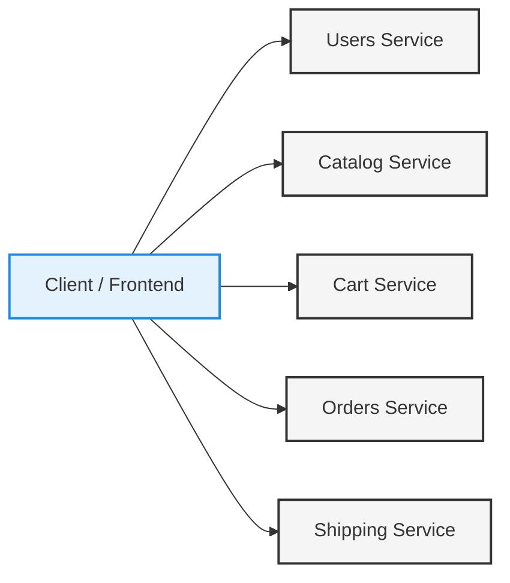
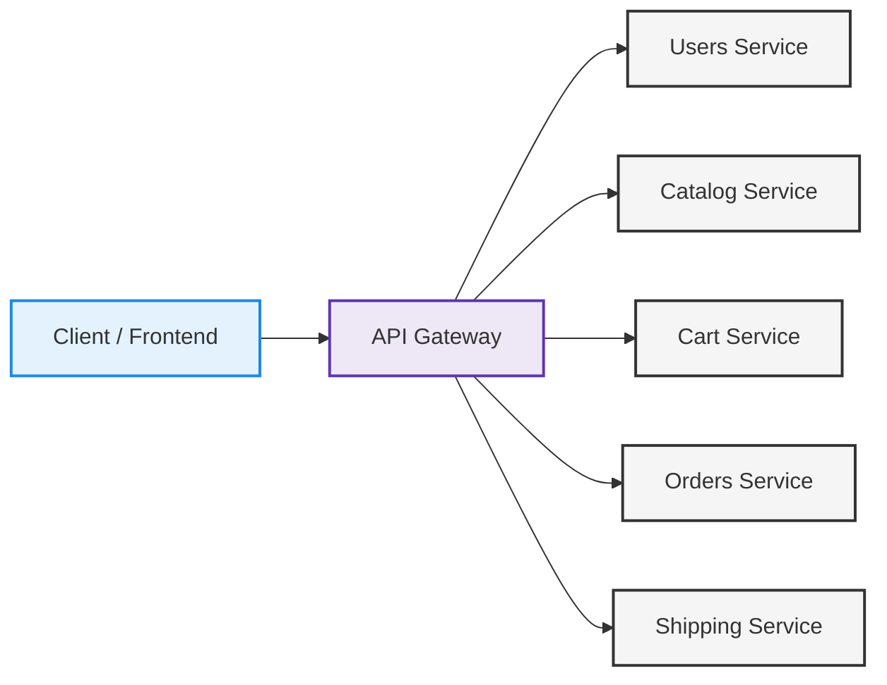
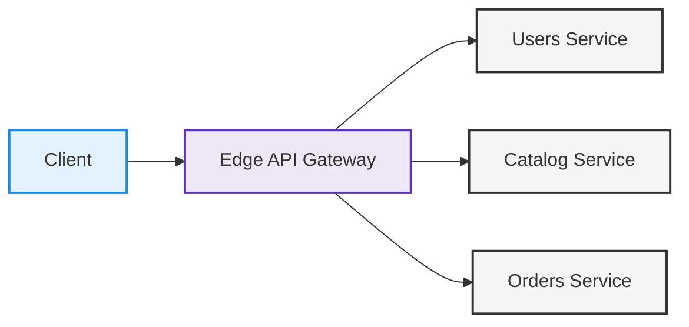
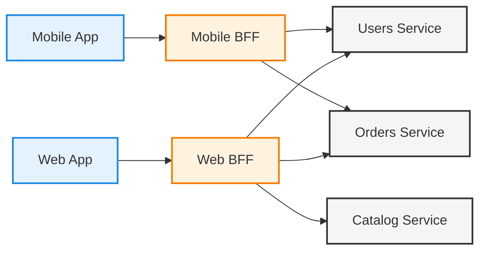
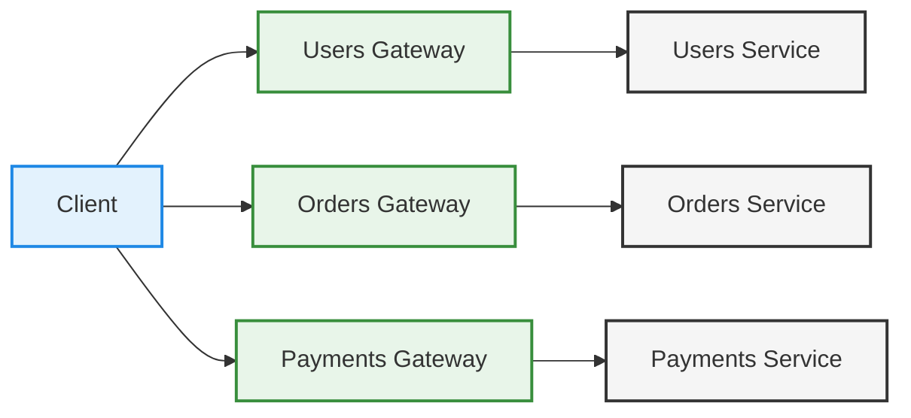
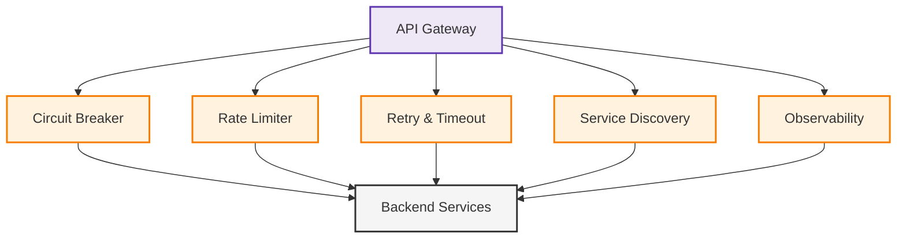
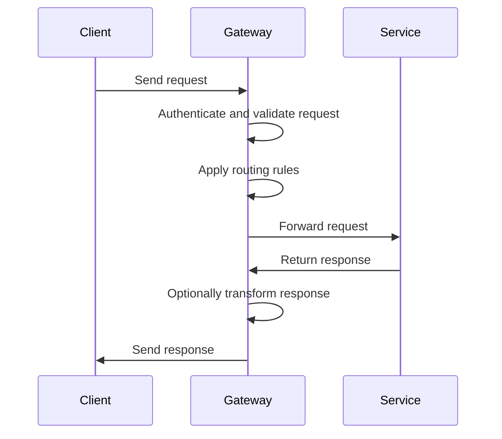

# API Gateway

## Introduction: the underlying problem

As systems move toward a microservices architecture, backend functionality is usually split into multiple independent services. Each service is developed, deployed, and scaled on its own, often running on different ports, hosts, or even different infrastructures.

This approach improves flexibility and scalability, but it also creates new challenges, especially at the point where clients interact with services.

Some common issues that appear are:

* Clients need to know the exact network location (domain, port, protocol) of each service.
* Any change in a service address forces updates in client code.
* Adding new backend features often requires changes on the client side.
* Authentication, authorization, logging, and validation logic is duplicated across services.
* Cross-cutting concerns are implemented multiple times and in inconsistent ways.

Over time, these problems create tight coupling between clients and the internal structure of the system, making it harder to evolve, secure, and understand.

An API Gateway is an architectural pattern that addresses these issues by providing a single, controlled entry point between clients and a system made up of multiple services.

This document explains the API Gateway pattern from its core ideas, without relying on any specific programming language, framework, or product.

### A concrete example

In a simple system, a client usually talks directly to a single backend application. As the system grows and moves toward a distributed or microservices-based architecture, that simplicity is lost.

Imagine a basic e-commerce platform with the following backend services:

* users
* catalog
* cart
* orders
* shipping

Without an API Gateway, the frontend must communicate with each service separately. This means it needs to know how to reach every service on its own:

* Requests to the users service go to something like `http://users-service.com`
* Requests to the cart service go to `http://cart-service.com`
* Requests to the orders service go to `http://orders-service.com`
* And so on

 

In this setup, the frontend is responsible for:

* Knowing all service endpoints
* Handling authentication on every request
* Managing retries, errors, and failures
* Adapting when services change

As more services are added, this approach becomes harder to manage. The frontend ends up tightly coupled to the backend structure, and any change on the backend quickly impacts the clients.

## What is an API Gateway?

An **API Gateway** is an architectural component that acts as a **single entry point** to a system made up of multiple backend services.

Instead of having clients communicate directly with many different services, all requests go through the gateway first. The gateway receives those requests, applies common logic, and then routes each one to the service that should handle it.

At a conceptual level, an API Gateway:

* Works as a facade in front of a group of backend services
* Hides the internal structure and location of services from clients
* Centralizes concerns that are shared across the system
* Controls how external requests enter and move through the system
* Exposes a stable interface, even while internal services change and evolve

It is important to clarify that:

> An API Gateway is not tied to a specific technology or framework.
> It represents a **conceptual role** within the system architecture.

Whether it is implemented using Spring, Node.js, Go, Nginx, or any other stack, the core responsibilities stay the same. The tools may change, but the problems it solves and the trade-offs it introduces remain consistent.

***

## Position in the architecture

At a high level, the API Gateway is placed between clients and backend services, acting as an intermediary layer that all external requests must pass through.

Using the previous example, the architecture would look like this:

 

From the client’s point of view, the system appears much simpler:

* There is a single backend entry point to communicate with.
* The internal organization, number of services, and their locations are completely hidden.

From the system’s point of view, the gateway takes on an active role:

* Incoming requests are received and inspected.
* Requests can be validated, authenticated, and authorized.
* Traffic is routed to the appropriate backend service.
* Requests or responses may be adapted or transformed when needed before reaching the service or returning to the client.

By clearly separating clients from internal services, this setup allows backend services to change, scale, or be reorganized independently. At the same time, the external interface exposed to clients remains stable, predictable, and easier to maintain.

***

## Core responsibilities

An API Gateway is mainly responsible for **technical and infrastructural concerns**, not for implementing business rules or domain logic. Its goal is to handle everything related to how requests enter the system and how they move across services, while keeping the services themselves focused on their own responsibilities.

Some of the most common responsibilities of an API Gateway are described below.

### Security and access control

The gateway is often the first line of defense of the system. It handles:

* Authentication of incoming requests, such as validating tokens, API keys, or sessions
* Authorization, ensuring that clients have permission to access specific resources or operations
* Input validation and request filtering to block invalid or malicious requests early

By centralizing these checks, services can rely on consistent security rules without reimplementing them individually.

However, centralizing authentication and authorization at the gateway **does not mean that backend services should blindly trust it**. Each service remains responsible for protecting its own boundaries and validating the security context relevant to its domain. Relying exclusively on the gateway introduces hidden coupling and increases the risk of security failures in case of misconfiguration, bypasses, or internal traffic paths.

> A common and healthy approach is to treat gateway-level security as a first filter, while allowing services to perform additional validation—such as verifying token expiration or enforcing domain-specific access rules—either directly or through a shared security component (for example, a **sidecar**). This layered approach reinforces system robustness without pushing business logic into the gateway.

### Routing and request handling

One of the core tasks of the gateway is to decide where each request should go. This includes:

* Mapping incoming requests to the correct backend service
* Supporting routing based on paths or API versions
* Applying conditional routing rules based on headers, request metadata, or execution context

This logic allows the backend to remain flexible while exposing a clean and stable API to clients.

### Load balancing

The gateway can also act as a traffic distributor by:

* Spreading incoming requests across multiple instances of the same service
* Enabling horizontal scaling without requiring changes on the client side

This helps the system handle increased load and improves overall availability.

### Resilience mechanisms

To protect the system from failures and unstable dependencies, the gateway may implement:

* **Circuit breakers** to stop requests to failing services and avoid cascading failures
* **Retries and timeouts** to handle temporary network or service issues
* Graceful degradation strategies when some functionality is unavailable
* Fallback behavior that provides alternative responses when services cannot be reached

These mechanisms improve system stability and protect clients from internal failures.

### Observability

Because all requests pass through it, the gateway is a natural place to collect operational data, such as:

* Centralized logging of requests and responses
* Metrics related to traffic, latency, and errors
* Distributed tracing support using correlation IDs to track requests across services

This visibility is essential for monitoring, debugging, and understanding system behavior.

### Service discovery

In dynamic environments, service locations often change. The gateway can handle this by:

* Dynamically resolving which service instances are currently available
* Avoiding hardcoded addresses and static configurations

This allows services to scale, restart, or move without impacting clients.

### Caching

To improve performance and reduce unnecessary load, the gateway may also provide:

* Caching of frequent or expensive responses
* Faster response times for commonly requested data
* Reduced pressure on backend services

> A key principle to keep in mind is that **the gateway should remain thin**.
> Business rules and domain logic belong inside backend services, not in the gateway itself.

***

## What an API Gateway is NOT

Misunderstanding the role of an API Gateway often leads to poor architectural decisions and long-term problems.

An API Gateway is **not**:

* A place to implement business rules or domain logic
* A substitute for clearly defined service boundaries
* A fix for poorly designed or tightly coupled microservices
* Just a reverse proxy, even though it may include proxy-like behavior

When an API Gateway is used to compensate for weak service design, the result is usually a fragile and overly complex system. Instead of simplifying the architecture, the gateway becomes a bottleneck that hides deeper issues and makes the system harder to evolve and maintain.

***

## Common ways to structure an API Gateway

API Gateways can be structured in different ways depending on system scale, client diversity, and organizational constraints. These approaches are **not mutually exclusive** and are often combined in real-world systems.

Rather than representing distinct architectural patterns, the following structures describe **common strategies** for organizing and evolving an API Gateway over time.

### 1. Edge API Gateway (baseline)

In its simplest form, a single API Gateway sits at the edge of the system and acts as the entry point for all external traffic. Every request (regardless of client type) flows through the same gateway before being routed to backend services.

This model centralizes security, routing, rate limiting, and other cross-cutting concerns in one place. It is straightforward to understand and operate, making it a common starting point for many systems.

However, as the number of clients and use cases grows, this gateway may begin to accumulate client-specific logic, increasing complexity and reducing clarity.

 

### 2. Backend-for-Frontend (BFF): a specialized API Gateway

The **Backend-for-Frontend (BFF)** pattern is not an alternative to an API Gateway, but a **specialized form of it**.

A BFF is an API Gateway designed explicitly for a **single client type**, such as a web application, a mobile app, or a third-party consumer. Instead of exposing a generic API intended to serve all clients, each BFF shapes its API around the needs of its specific frontend.

Typical responsibilities of a BFF include:

* Aggregating data from multiple services
* Adapting response formats to client needs
* Reducing client-side complexity
* Encapsulating client-specific workflows

This approach improves client experience and autonomy at the cost of some duplication and additional operational overhead.

A useful mental model is:

> An API Gateway protects the system.
> A BFF optimizes the frontend.

 

### 3. Domain-aligned gateways (organizational strategy)

In larger systems, gateways are sometimes aligned with **business domains** rather than with clients. Each gateway is responsible for handling requests related to a specific domain, such as users, orders, or payments.

This approach is **not a formally defined architectural pattern**, but rather an **organizational strategy** that emerges in systems following domain-driven design or team-oriented architectures.

Domain-aligned gateways can:

* Increase team autonomy
* Reduce cross-team coordination
* Align ownership with bounded contexts

At the same time, they may:

* Increase complexity on the client side
* Require clearer coordination between gateways
* Introduce additional routing decisions

Because of these trade-offs, domain alignment is typically considered an **advanced design choice**, rather than a default starting point.

 

### Choosing the right structure

There is no universally correct way to structure an API Gateway. Real-world systems often combine these approaches:

* An **edge gateway** for global security and traffic control
* One or more **BFFs** for client-specific APIs
* Domain alignment as an internal organizational decision

The right choice depends on system scale, team structure, client diversity, and operational maturity.

***

## Relationship with other patterns

An API Gateway rarely exists in isolation. In real-world systems, it usually works together with other well-known distributed systems patterns to improve reliability, stability, and visibility across the architecture.

Some of the most common patterns used alongside an API Gateway include:

* **Circuit Breaker**, which helps isolate failing services and prevents errors from cascading through the system
* **Rate Limiter**, used to control traffic and protect backend services from overload or abuse
* **Retry and Timeout**, which handle temporary failures by retrying requests and avoiding indefinite waits
* **Service Discovery**, which allows the system to dynamically locate available service instances in changing environments
* **Observability**, which provides tracing, logging, and monitoring to understand system behavior and performance

 

The API Gateway is often the first place where these concerns are applied, since all external traffic flows through it. However, it is important to understand that these patterns should not live only at the gateway level.

Many of these mechanisms are also valuable inside the system, closer to the services themselves. Applying them at multiple layers helps create a more resilient architecture and avoids relying on a single component to handle all cross-cutting concerns.

***

## Trade-offs and operational costs

Introducing an API Gateway always comes with costs and trade-offs. While it can simplify many aspects of a distributed system, it also adds new challenges that need to be carefully considered.

Some of the most important trade-offs are:

* **Increased latency**, caused by the additional network hop introduced by the gateway
* **Operational overhead**, since the gateway is another critical component that must be deployed, configured, monitored, and maintained
* **Single Point of Failure**, if high availability and redundancy are not properly designed
* **More complex response handling**, especially when dealing with streaming, real-time communication, or long-lived connections
* **Harder debugging**, because failures or unexpected behavior may occur at the gateway before requests even reach backend services

Because the API Gateway sits directly in the critical path of all client requests, its reliability has a direct impact on the entire system. For this reason, it must be designed with strong availability guarantees, clear observability, and solid failure-handling strategies from the start.

***

## Conceptual request flow

At a conceptual level, the request flow through an API Gateway follows a clear and predictable sequence. Regardless of the programming language, framework, or specific implementation, the same core steps usually apply.

The flow can be visualized as follows:

 

In this flow, the client interacts only with the gateway, without direct knowledge of the backend services. The gateway takes responsibility for validating and processing the request, deciding where it should go, and optionally adapting the response before sending it back. This structure keeps clients simple while allowing the internal system to evolve independently.

***

## Best practices

When using an API Gateway, following a set of clear guidelines helps keep the architecture clean, maintainable, and resilient over time.

A few widely accepted best practices are:

* Keep the gateway focused on infrastructural concerns, such as routing, security, and traffic management
* Avoid embedding business or domain logic, which should remain inside backend services
* Design the gateway with failure in mind, including redundancy and high availability
* Monitor the gateway as a first-class component, since it sits on the critical path of all requests
* Treat the gateway as part of the system’s public contract, because changes can directly affect clients

These practices help ensure that the gateway supports the system instead of becoming a source of complexity.

***

## Common anti-patterns

There are also common mistakes that can undermine the benefits of an API Gateway if not avoided.

Some frequent anti-patterns include:

* Turning the gateway into a “god service” that tries to handle too many responsibilities
* Making the gateway aware of internal data models or service-specific details
* Using the gateway to hide poor service design instead of fixing the underlying problems
* Overloading it with logic that is unrelated to request handling and traffic management

Avoiding these anti-patterns helps keep the gateway simple, reliable, and aligned with its intended role in the architecture.

***

## Relation to this repository

This document explains the **API Gateway pattern at a conceptual level**, focusing on the ideas and responsibilities behind the pattern rather than on any specific implementation.

The file [**API-GATEWAY-WITH-SPRING.md**](API-GATEWAY-WITH-SPRING.md) translates these concepts into a concrete implementation using Spring-based tools, while staying faithful to the architectural intent described here.
